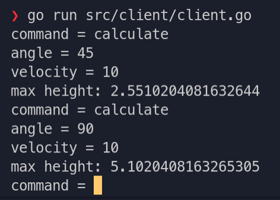
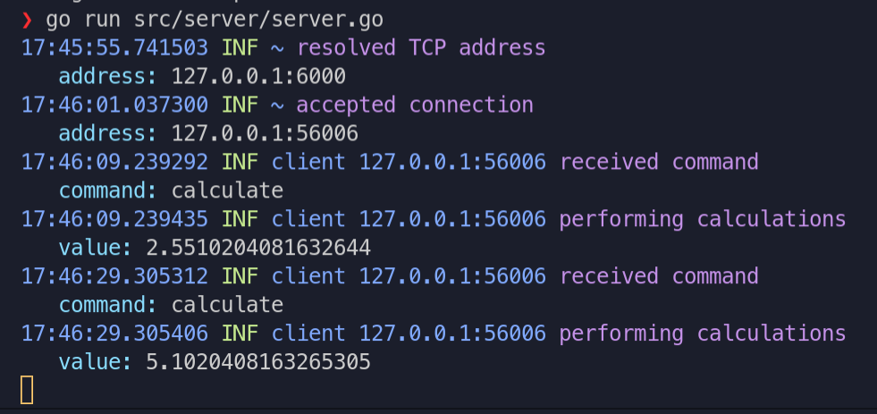

# Цели

Целью данной работы является знакомство с принципами разработки протоколов прикладного уровня и их реализацией на языке Go.

# Задачи

Протокол вычисления наибольшей высоты, на которую поднимется камень, брошенный с земли под углом к горизонту.

# Решение

## Исходный код

#### **`client.go`**

```{ .go .number-lines startFrom="1" .lineAnchors }
package main

import (
	"encoding/json"
	"flag"
	"fmt"
	"lab1/src/proto"
	"net"
)

// interact - функция, содержащая цикл взаимодействия с сервером.
func interact(conn *net.TCPConn) {
	defer conn.Close()
	encoder, decoder := json.NewEncoder(conn), json.NewDecoder(conn)
	for {
        // Чтение команды из стандартного потока ввода
		fmt.Printf("command = ")
		var command string
		fmt.Scan(&command)

        // Отправка запроса.
		switch command {
		case "quit":
			sendRequest(encoder, "quit", nil)
			return
		case "calculate":
			var task proto.Task
			fmt.Printf("angle = ")
			fmt.Scan(&task.Angle)
			fmt.Printf("velocity = ")
			fmt.Scan(&task.Velocity)
			sendRequest(encoder, "calculate", &task)
        default:
            fmt.Printf("error: unknown command\n")
            continue
		}

		// Получение ответа.
		var resp proto.Response
		if err := decoder.Decode(&resp); err != nil {
			fmt.Printf("error: %v\n", err)
			break
		}

		// Вывод ответа в стандартный поток вывода.
		switch resp.Status {
		case "ok":
			fmt.Printf("ok\n")
		case "failed":
			if resp.Data == nil {
				fmt.Printf("error: data field is absent in response\n")
			} else {
				var errorMsg string
				if err := json.Unmarshal(*resp.Data, &errorMsg); err != nil {
					fmt.Printf("error: malformed data field in response\n")
				} else {
					fmt.Printf("failed: %s\n", errorMsg)
				}
			}
		case "result":
			if resp.Data == nil {
				fmt.Printf("error: data field is absent in response\n")
			} else {
				var height float64
				if err := json.Unmarshal(*resp.Data, &height); err != nil {
					fmt.Printf("error: malformed data field in response\n")
				} else {
					fmt.Printf("max height: %v\n", height)
				}
			}
		default:
			fmt.Printf("error: server reports unknown status %q\n", resp.Status)
		}
	}
}

// sendRequest - вспомогательная функция для передачи запроса с указанной командой
// и данными. Данные могут быть пустыми (data == nil).
func sendRequest(encoder *json.Encoder, command string, data interface{}) {
	var raw json.RawMessage
	raw, _ = json.Marshal(data)
	encoder.Encode(&proto.Request{Command: command, Data: &raw})
}

func main() {
	// Работа с командной строкой, в которой может указываться необязательный ключ -addr.
	var addrStr string
	flag.StringVar(&addrStr, "addr", "127.0.0.1:6000", "specify ip address and port")
	flag.Parse()

	// Разбор адреса, установка соединения с сервером и
	// запуск цикла взаимодействия с сервером.
	if addr, err := net.ResolveTCPAddr("tcp", addrStr); err != nil {
		fmt.Printf("error: %v\n", err)
	} else if conn, err := net.DialTCP("tcp", nil, addr); err != nil {
		fmt.Printf("error: %v\n", err)
	} else {
		interact(conn)
	}
}

```

#### **`server.go`**

```{ .go .number-lines startFrom="1" .lineAnchors }
package main

import (
	"encoding/json"
	"flag"
	"fmt"
	"lab1/src/proto"
	"math"
	"net"

	log "github.com/mgutz/logxi/v1"
)

const g = 9.8

// Client - состояние клиента.
type Client struct {
	logger log.Logger    // Объект для печати логов
	conn   *net.TCPConn  // Объект TCP-соединения
	enc    *json.Encoder // Объект для кодирования и отправки сообщений
	count  int64         // Количество полученных от клиента задач
}

// NewClient - конструктор клиента, принимает в качестве параметра
// объект TCP-соединения.
func NewClient(conn *net.TCPConn) *Client {
	return &Client{
		logger: log.New(fmt.Sprintf("client %s", conn.RemoteAddr().String())),
		conn:   conn,
		enc:    json.NewEncoder(conn),
		count:  0,
	}
}

// serve - метод, в котором реализован цикл взаимодействия с клиентом.
// Подразумевается, что метод serve будет вызаваться в отдельной go-программе.
func (client *Client) serve() {
	defer client.conn.Close()
	decoder := json.NewDecoder(client.conn)
	for {
		var req proto.Request
		if err := decoder.Decode(&req); err != nil {
			client.logger.Error("cannot decode message", "reason", err)
			break
		} else {
			client.logger.Info("received command", "command", req.Command)
			if client.handleRequest(&req) {
				client.logger.Info("shutting down connection")
				break
			}
		}
	}
}

// handleRequest - метод обработки запроса от клиента. Он возвращает true,
// если клиент передал команду "quit" и хочет завершить общение.
func (client *Client) handleRequest(req *proto.Request) bool {
	switch req.Command {
	case "quit":
		client.respond("ok", nil)
		return true
	case "calculate":
		errorMsg := ""
		var x float64
		if req.Data == nil {
			errorMsg = "data field is absent"
		} else {
			var task proto.Task
			if err := json.Unmarshal(*req.Data, &task); err != nil {
				errorMsg = "malformed data field"
			} else {
				x = math.Pow(task.Velocity, 2) * math.Pow(math.Sin(task.Angle * math.Pi / 180), 2) / (2 * g)
				client.logger.Info("performing calculations", "value", x)
				client.count++
			}
		}
		if errorMsg == "" {
			client.respond("result", &x)
		} else {
			client.logger.Error("calculation failed", "reason", errorMsg)
			client.respond("failed", errorMsg)
		}
	default:
		client.logger.Error("unknown command")
		client.respond("failed", "unknown command")
	}
	return false
}

// respond - вспомогательный метод для передачи ответа с указанным статусом
// и данными. Данные могут быть пустыми (data == nil).
func (client *Client) respond(status string, data interface{}) {
	var raw json.RawMessage
	raw, _ = json.Marshal(data)
	client.enc.Encode(&proto.Response{Status: status, Data: &raw})
}

func main() {
    // Работа с командной строкой, в которой может указываться необязательный ключ -addr.
	var addrStr string
	flag.StringVar(&addrStr, "addr", "127.0.0.1:6000", "specify ip address and port")
	flag.Parse()

    // Разбор адреса, строковое представление которого находится в переменной addrStr.
	if addr, err := net.ResolveTCPAddr("tcp", addrStr); err != nil {
		log.Error("address resolution failed", "address", addrStr)
	} else {
		log.Info("resolved TCP address", "address", addr.String())

        // Инициация слушания сети на заданном адресе.
		if listener, err := net.ListenTCP("tcp", addr); err != nil {
			log.Error("listening failed", "reason", err)
		} else {
            // Цикл приёма входящих соединений.
			for {
				if conn, err := listener.AcceptTCP(); err != nil {
					log.Error("cannot accept connection", "reason", err)
				} else {
					log.Info("accepted connection", "address", conn.RemoteAddr().String())

                    // Запуск go-программы для обслуживания клиентов.
					go NewClient(conn).serve()
				}
			}
		}
	}
}

```

#### **`proto.go`**

```{.go .number-lines startFrom="1" .lineAnchors}
package proto

import "encoding/json"

// Request -- запрос клиента к серверу.
type Request struct {
	// Поле Command может принимать три значения:
	// * "quit" - прощание с сервером (после этого сервер рвёт соединение);
	// * "calculate" - передача новой задачи на сервер;
	Command string `json:"command"`

	Data *json.RawMessage `json:"data"`
}

// Response -- ответ сервера клиенту.
type Response struct {
	// Поле Status может принимать три значения:
	// * "ok" - успешное выполнение команды "quit";
	// * "failed" - в процессе выполнения команды произошла ошибка;
	// * "result" - максимальная высота вычислена.
	Status string `json:"status"`

	// Если Status == "failed", то в поле Data находится сообщение об ошибке.
	// Если Status == "result", в поле Data должна лежать высота
	// В противном случае, поле Data пустое.
	Data *json.RawMessage `json:"data"`
}

// Task -- условие задачи для вычисления сервером
type Task struct {
	// Угол от горизонта в градусах
	Angle float64 `json:"angle"`

	// Общая скорость тела в начале движения
	Velocity float64 `json:"Velocity"`
}

```

## Пример работы




