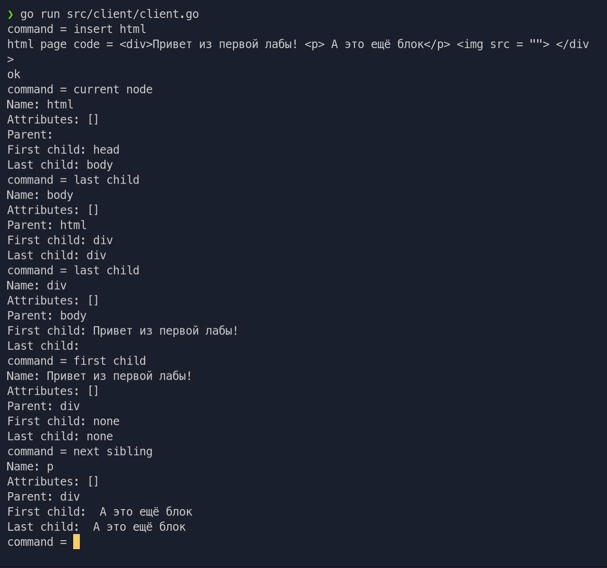

# Цели

Целью данной работы является знакомство с принципами разработки протоколов прикладного уровня и их реализацией на языке Go.

# Задачи

Протокол обхода дерева элементов HTML-страницы. (Нужно воспользоваться пакетом "golang.org/x/net/html".)

# Решение

## Исходный код

**`client.go`**

```go
package main

import (
	"bufio"
	"encoding/json"
	"flag"
	"fmt"
	"lab1/src/proto"
	"net"
	"os"
)

// interact - функция, содержащая цикл взаимодействия с сервером.
func interact(conn *net.TCPConn) {
	defer conn.Close()
	encoder, decoder := json.NewEncoder(conn), json.NewDecoder(conn)
	for {
		// Чтение команды из стандартного потока ввода
		fmt.Printf("command = ")
		var command string
		reader := bufio.NewReader(os.Stdin)
		buf, _, _ := reader.ReadLine()
		command = string(buf)

		// Отправка запроса.
		switch command {
		case "quit":
			sendRequest(encoder, "quit", nil)
			return
		case "insert html":
			var page proto.HtmlPage
			fmt.Printf("html page code = ")
			buf, _, _ := reader.ReadLine()
			page.Code = string(buf)
			sendRequest(encoder, "insert html", &page)
		case "parent node":
			sendRequest(encoder, "parent node", nil)
		case "first child":
			sendRequest(encoder, "first child", nil)
		case "last child":
			sendRequest(encoder, "last child", nil)
		case "prev sibling":
			sendRequest(encoder, "prev sibling", nil)
		case "next sibling":
			sendRequest(encoder, "next sibling", nil)
		case "current node":
			sendRequest(encoder, "current node", nil)
		default:
			fmt.Printf("error: unknown command\n")
			continue
		}

		// Получение ответа.
		var resp proto.Response
		if err := decoder.Decode(&resp); err != nil {
			fmt.Printf("error: %v\n", err)
			break
		}

		// Вывод ответа в стандартный поток вывода.
		switch resp.Status {
		case "ok":
			fmt.Printf("ok\n")
		case "failed":
			if resp.Data == nil {
				fmt.Printf("error: data field is absent in response\n")
			} else {
				var errorMsg string
				if err := json.Unmarshal(*resp.Data, &errorMsg); err != nil {
					fmt.Printf("error: malformed data field in response\n")
				} else {
					fmt.Printf("failed: %s\n", errorMsg)
				}
			}
		case "result":
			if resp.Data == nil {
				fmt.Printf("error: data field is absent in response\n")
			} else {
				var node proto.NodeForTransfer
				if err := json.Unmarshal(*resp.Data, &node); err != nil {
					fmt.Printf("error: malformed data field in response\n")
				} else {
					fmt.Printf("Name: %s\nAttributes: %v\nParent: %v\nFirst child: %v\nLast child: %v\n", node.Data, node.Attr, node.Parent, node.FirstChild, node.LastChild)
				}
			}
		default:
			fmt.Printf("error: server reports unknown status %q\n", resp.Status)
		}
	}
}

// sendRequest - вспомогательная функция для передачи запроса с указанной командой
// и данными. Данные могут быть пустыми (data == nil).
func sendRequest(encoder *json.Encoder, command string, data interface{}) {
	var raw json.RawMessage
	raw, _ = json.Marshal(data)
	encoder.Encode(&proto.Request{Command: command, Data: &raw})
}

func main() {
	//buf := `<!DOCTYPE html><html lang="en"><head> <meta charset="UTF-8"> <meta http-equiv="X-UA-Compatible" content="IE=edge"> <meta name="viewport" content="width=device-width, initial-scale=1.0"> <title>Document</title></head><body> </body></html>`
	/* foo := "<div><p>1232</p>dsadsada</div>"
	res, _ := html.Parse(strings.NewReader(foo))
	fmt.Println(res.LastChild.LastChild.FirstChild.FirstChild.NextSibling) */
	// Работа с командной строкой, в которой может указываться необязательный ключ -addr.
	var addrStr string
	flag.StringVar(&addrStr, "addr", "127.0.0.1:6000", "specify ip address and port")
	flag.Parse()

	// Разбор адреса, установка соединения с сервером и
	// запуск цикла взаимодействия с сервером.
	if addr, err := net.ResolveTCPAddr("tcp", addrStr); err != nil {
		fmt.Printf("error: %v\n", err)
	} else if conn, err := net.DialTCP("tcp", nil, addr); err != nil {
		fmt.Printf("error: %v\n", err)
	} else {
		interact(conn)
	}
}

```

**`proto.go`**

```go
package proto

import (
	"encoding/json"

	"golang.org/x/net/html"
)

// Request -- запрос клиента к серверу.
type Request struct {
	// Поле Command может принимать три значения:
	// * "quit" - прощание с сервером (после этого сервер рвёт соединение);
	// * "calculate" - передача новой задачи на сервер;
	Command string `json:"command"`

	Data *json.RawMessage `json:"data"`
}

// Response -- ответ сервера клиенту.
type Response struct {
	// Поле Status может принимать три значения:
	// * "ok" - успешное выполнение команды "quit";
	// * "failed" - в процессе выполнения команды произошла ошибка;
	// * "result" - максимальная высота вычислена.
	Status string `json:"status"`

	// Если Status == "failed", то в поле Data находится сообщение об ошибке.
	// Если Status == "result", в поле Data должна лежать высота
	// В противном случае, поле Data пустое.
	Data *json.RawMessage `json:"data"`
}

// htmlPage - чистый код html страницы
type HtmlPage struct {
	Code string `json:"htmlCode"`
}

// Html элемент, но только с нужными для передачи полями
type NodeForTransfer struct {
	Parent     string           `json:"parent"`
	FirstChild string           `json:"fisrtChild"`
	LastChild  string           `json:"lastChild"`
	Data       string           `json:"data"`
	Namespace  string           `json:"namespace"`
	Attr       []html.Attribute `json:"attr"`
}

```

**`server.go`**

```go
package main

import (
	"encoding/json"
	"flag"
	"fmt"
	"lab1/src/proto"
	"net"
	"strings"

	log "github.com/mgutz/logxi/v1"
	"golang.org/x/net/html"
)

// Делает копию данного узла, содержащую только важную информацию для передачи клиенту
func createNodeForTransfer(node *html.Node) proto.NodeForTransfer {
	buf := proto.NodeForTransfer{
		Parent:    node.Parent.Data,
		Data:      node.Data,
		Namespace: node.Namespace,
		Attr:      node.Attr,
	}
	if node.FirstChild != nil {
		buf.FirstChild = node.FirstChild.Data
	} else {
		buf.FirstChild = "none"
	}
	if node.LastChild != nil {
		buf.LastChild = node.LastChild.Data
	} else {
		buf.LastChild = "none"
	}
	return buf
}

// Client - состояние клиента.
type Client struct {
	logger log.Logger    // Объект для печати логов
	conn   *net.TCPConn  // Объект TCP-соединения
	enc    *json.Encoder // Объект для кодирования и отправки сообщений
	page   *html.Node
}

// NewClient - конструктор клиента, принимает в качестве параметра
// объект TCP-соединения.
func NewClient(conn *net.TCPConn) *Client {
	return &Client{
		logger: log.New(fmt.Sprintf("client %s", conn.RemoteAddr().String())),
		conn:   conn,
		enc:    json.NewEncoder(conn),
	}
}

// serve - метод, в котором реализован цикл взаимодействия с клиентом.
// Подразумевается, что метод serve будет вызаваться в отдельной go-программе.
func (client *Client) serve() {
	defer client.conn.Close()
	decoder := json.NewDecoder(client.conn)
	for {
		var req proto.Request
		if err := decoder.Decode(&req); err != nil {
			client.logger.Error("cannot decode message", "reason", err)
			break
		} else {
			client.logger.Info("received command", "command", req.Command)
			if client.handleRequest(&req) {
				client.logger.Info("shutting down connection")
				break
			}
		}
	}
}

// handleRequest - метод обработки запроса от клиента. Он возвращает true,
// если клиент передал команду "quit" и хочет завершить общение.
func (client *Client) handleRequest(req *proto.Request) bool {
	switch req.Command {
	case "quit":
		client.respond("ok", nil)
		return true
	case "insert html":
		errorMsg := ""
		if req.Data == nil {
			errorMsg = "data field is absent"
		} else {
			var page proto.HtmlPage
			if err := json.Unmarshal(*req.Data, &page); err != nil {
				errorMsg = "malformed data field"
			} else {
				client.page, err = html.Parse(strings.NewReader(page.Code))
				if err != nil {
					errorMsg = "Parsing error, incorrect html page"
				} else {
					client.logger.Info("uploaded html page")
					client.respond("ok", nil)
					client.page = client.page.FirstChild
				}
			}
		}
		if errorMsg != "" {
			client.logger.Error("parsing failed", "reason", errorMsg)
			client.respond("failed", errorMsg)
		}
	case "parent node":
		errorMsg := ""
		node := client.page.Parent
		if node == nil {
			errorMsg = "missing parent node"
		} else {
			client.page = node
			client.logger.Info("Found and returned parent node")
		}
		if errorMsg == "" {
			buf := createNodeForTransfer(node)
			client.respond("result", &buf)
		} else {
			client.logger.Error("calculation failed", "reason", errorMsg)
			client.respond("failed", errorMsg)
		}
	case "first child":
		errorMsg := ""
		node := client.page.FirstChild
		if node == nil {
			errorMsg = "missing child node"
		} else {
			client.page = node
			client.logger.Info("Found and returned first child node")
		}
		if errorMsg == "" {
			buf := createNodeForTransfer(node)
			client.respond("result", &buf)
		} else {
			client.logger.Error("calculation failed", "reason", errorMsg)
			client.respond("failed", errorMsg)
		}
	case "current node":
		errorMsg := ""
		fmt.Println(client.page)
		if client.page == nil {
			errorMsg = "missing node"
		}
		if errorMsg == "" {
			client.logger.Info("returned cur node")
			buf := createNodeForTransfer(client.page)
			client.respond("result", &buf)
		} else {
			client.logger.Error("calculation failed", "reason", errorMsg)
			client.respond("failed", errorMsg)
		}
	case "last child":
		errorMsg := ""
		node := client.page.LastChild
		if node == nil {
			errorMsg = "missing child node"
		} else {
			client.page = node
			client.logger.Info("Found and returned last child node")
			fmt.Println(*node.LastChild)
		}
		if errorMsg == "" {
			buf := createNodeForTransfer(node)
			client.respond("result", &buf)
		} else {
			client.logger.Error("calculation failed", "reason", errorMsg)
			client.respond("failed", errorMsg)
		}
	case "prev sibling":
		errorMsg := ""
		node := client.page.PrevSibling
		if node == nil {
			errorMsg = "missing prev sibling"
		} else {
			client.page = node
			client.logger.Info("Found and returned prev sibling node")
		}
		if errorMsg == "" {
			buf := createNodeForTransfer(node)
			client.respond("result", &buf)
		} else {
			client.logger.Error("calculation failed", "reason", errorMsg)
			client.respond("failed", errorMsg)
		}
	case "next sibling":
		errorMsg := ""
		node := client.page.NextSibling
		if node == nil {
			errorMsg = "missing next sibling"
		} else {
			client.page = node
			client.logger.Info("Found and returned next sibling node")
		}
		if errorMsg == "" {
			buf := createNodeForTransfer(node)
			client.respond("result", &buf)
		} else {
			client.logger.Error("calculation failed", "reason", errorMsg)
			client.respond("failed", errorMsg)
		}
	default:
		client.logger.Error("unknown command")
		client.respond("failed", "unknown command")
	}
	return false
}

// respond - вспомогательный метод для передачи ответа с указанным статусом
// и данными. Данные могут быть пустыми (data == nil).
func (client *Client) respond(status string, data interface{}) {
	var raw json.RawMessage
	raw, _ = json.Marshal(data)
	client.enc.Encode(&proto.Response{Status: status, Data: &raw})
}

func main() {
	// Работа с командной строкой, в которой может указываться необязательный ключ -addr.
	var addrStr string
	flag.StringVar(&addrStr, "addr", "127.0.0.1:6000", "specify ip address and port")
	flag.Parse()

	// Разбор адреса, строковое представление которого находится в переменной addrStr.
	if addr, err := net.ResolveTCPAddr("tcp", addrStr); err != nil {
		log.Error("address resolution failed", "address", addrStr)
	} else {
		log.Info("resolved TCP address", "address", addr.String())

		// Инициация слушания сети на заданном адресе.
		if listener, err := net.ListenTCP("tcp", addr); err != nil {
			log.Error("listening failed", "reason", err)
		} else {
			// Цикл приёма входящих соединений.
			for {
				if conn, err := listener.AcceptTCP(); err != nil {
					log.Error("cannot accept connection", "reason", err)
				} else {
					log.Info("accepted connection", "address", conn.RemoteAddr().String())

					// Запуск go-программы для обслуживания клиентов.
					go NewClient(conn).serve()
				}
			}
		}
	}
}

```
## Пример работы




