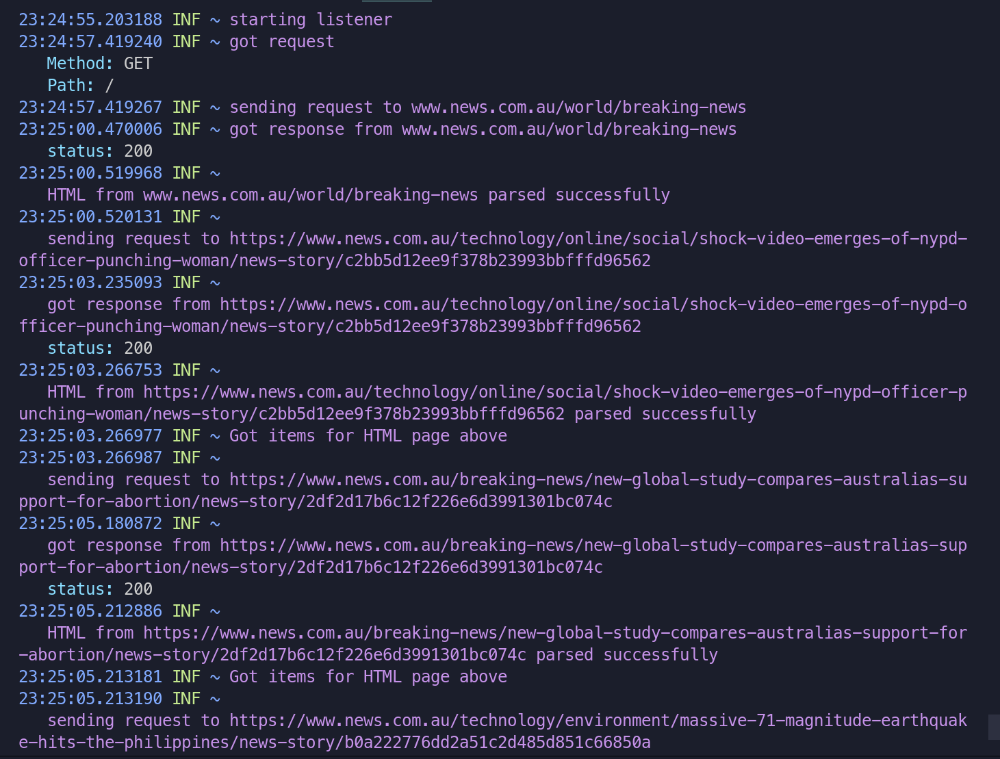
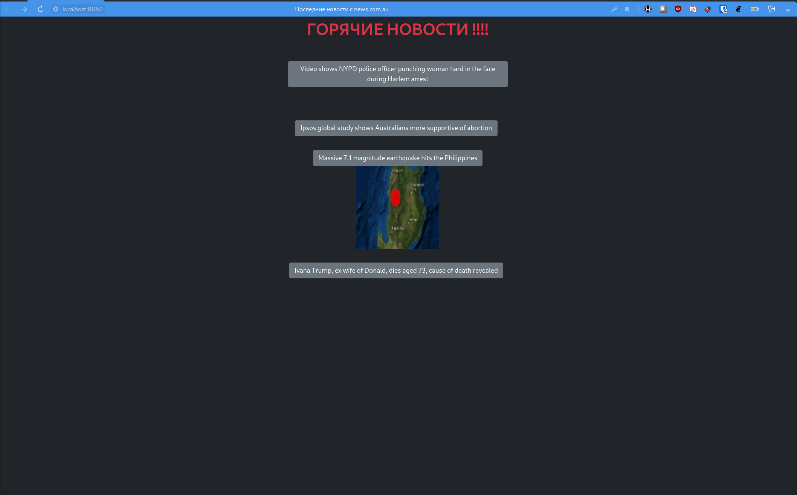

# Цели

Целью данной работы является создание HTTP-клиента и HTTP-сервера на языке Go.

# Задачи

В ходе выполнения лабораторной работы нужно разработать на языке Go HTTP-сервер,
который формирует динамические HTML-страницы на основе данных, получаемых с
указанного web-сервера. Детали задания приведены в таблицах ниже.
Основные требования к HTTP-серверу:

1. полная проверка данных, получаемых из сети (как от клиента, так и от web-сервера);
2. устойчивость к обрыву соединения;
3. возможность одновременного подключения нескольких клиентов к одному серверу;
4. сервер должен вести подробный лог всех ошибок, а также других важных событий
(установка и завершение соединения с клиентом, приём и передача сообщений, и т. п.);
5. в зависимости от варианта список новостей должен быть стилизован и содержать, в случае наличия на сайте-доноре, ссылки на первоисточник открывающейся в новом окне, в
случае наличия превью изображения к новости на сайте доноре, то это изображение
должно отображаться на реализовываемом HTTP-сервере.

# Решение

## Исходный код

**`server.go`**

```{.go .number-lines}
package main

import (
	"html/template"
	"net/http"

	log "github.com/mgutz/logxi/v1"
)

const INDEX_HTML = `
    <!doctype html>
    <html lang="ru">
        <head>
            <meta charset="utf-8">
            <title>Последние новости с news.com.au</title>
			<link
            href="https://cdn.jsdelivr.net/npm/bootstrap@5.0.2/dist/css/bootstrap.min.css"
            rel="stylesheet"
            integrity="sha384-EVSTQN3/azprG1Anm3QDgpJLIm9Nao0Yz1ztcQTwFspd3yD65VohhpuuCOmLASjC"
            crossorigin="anonymous"
        	/>
        </head>
        <body class="bg-dark">
			<div class="fs-1 fw-bold text-danger text-center mx-3"> ГОРЯЧИЕ НОВОСТИ !!!! </div>
			<div class="row">
			<div class="col-sm">
			</div>
			<div class="col-sm text-center fs-2 py-5">
				{{if .}}
					{{range .}}
						<div class="mb-4">
							<a href="{{.Ref}}" class="btn btn-secondary text-center mx-5">{{.Title}}</a>
							</img>
							<br/>
						</div>
					{{end}}
				{{else}}
					Не удалось загрузить новости!
				{{end}}
			</div>
			<div class="col-sm">
			</div>
			</div>
        </body>
    </html>
    `

var indexHtml = template.Must(template.New("index").Parse(INDEX_HTML))

func serveClient(response http.ResponseWriter, request *http.Request) {
	path := request.URL.Path
	log.Info("got request", "Method", request.Method, "Path", path)
	if path != "/" && path != "/index.html" {
		log.Error("invalid path", "Path", path)
		response.WriteHeader(http.StatusNotFound)
	} else if err := indexHtml.Execute(response, downloadNews()); err != nil {
		log.Error("HTML creation failed", "error", err)
	} else {
		log.Info("response sent to client successfully")
	}
}

func main() {
	http.HandleFunc("/", serveClient)
	log.Info("starting listener")
	log.Error("listener failed", "error", http.ListenAndServe("127.0.0.1:8080", nil))
}


```

**`download.go`**

```{.go .number-lines}
package main

import (
	"net/http"
	"strings"

	log "github.com/mgutz/logxi/v1"
	"golang.org/x/net/html"
)

const RootUrl = "www.news.com.au/"
const URL = "www.news.com.au/world/breaking-news"

type Item struct {
	Ref, Title, ImageSrc string
}

func getAttribute(node *html.Node, key string) string {
	for _, attr := range node.Attr {
		if attr.Key == key {
			return attr.Val
		}
	}
	return ""
}

func getChildren(node *html.Node) []*html.Node {
	var children []*html.Node
	for c := node.FirstChild; c != nil; c = c.NextSibling {
		children = append(children, c)
	}
	return children
}

func isElement(node *html.Node, tag string) bool {
	return node != nil && node.Type == html.ElementNode && node.Data == tag
}

func isTextNode(node *html.Node) bool {
	return node != nil && node.Type == html.TextNode
}

func getChildElement(node *html.Node, tag string) *html.Node {
	if node == nil {
		return nil
	}

	for child := node.FirstChild; child != nil; child = child.NextSibling {
		if isElement(child, tag) {
			return child
		}
	}

	return nil
}

func getElementsByPredicate(node *html.Node, predicate func(*html.Node) bool) []*html.Node {
	var nodes []*html.Node

	for _, child := range getChildren(node) {
		if predicate(child) {
			nodes = append(nodes, child)
		}
		nodes = append(nodes, getElementsByPredicate(child, predicate)...)
	}
	/* newNode := nodes[0].FirstChild
	var newsNodes []*html.Node
	for child := newNode.FirstChild; child != nil; child = child.NextSibling {
		if 2+5 == 1+6 {
			newsNodes = append(newsNodes, child)
		}
	}
	return newsNodes */
	return nodes
}

func getTitle(doc *html.Node) string {
	nodes := getElementsByPredicate(doc, func(node *html.Node) bool {
		return node.Data == "title"
	})

	if len(nodes) == 0 {
		return ""
	}

	if children := getChildren(nodes[0]); len(children) == 1 && isTextNode(children[0]) {
		return children[0].Data
	}

	return ""
}

func getImageSrc(doc *html.Node) string {
	nodes := getElementsByPredicate(doc, func(node *html.Node) bool {
		return getAttribute(node, "class") == "responsive-img"
	})

	if len(nodes) == 0 {
		return ""
	}

	img := nodes[0].FirstChild
	if img == nil {
		return ""
	}

	return getAttribute(img, "src")
}

func getItem(url string, doc *html.Node) *Item {
	return &Item{
		Ref:      url,
		Title:    strings.Split(getTitle(doc), " | ")[0],
		ImageSrc: getImageSrc(doc),
	}
}

func getItems(nodes []*html.Node) []*Item {
	var items []*Item

	for _, node := range nodes {
		url := getAttribute(node.FirstChild.NextSibling, "href")
		doc := downloadHtml(url)
		items = append(items, getItem(url, doc))
		log.Info("Got items for HTML page above")
	}

	return items
}

func downloadHtml(url string) *html.Node {
	log.Info("sending request to " + url)
	if response, err := http.Get(url); err != nil {
		log.Error("request to "+url+" failed", "error", err)
	} else {
		defer response.Body.Close()
		status := response.StatusCode
		log.Info("got response from "+url, "status", status)
		if status == http.StatusOK {
			if doc, err := html.Parse(response.Body); err != nil {
				log.Error("invalid HTML from "+url, "error", err)
			} else {
				log.Info("HTML from " + url + " parsed successfully")

				return doc
			}
		}
	}

	return nil
}

func downloadNews() []*Item {
	log.Info("sending request to " + URL)
	if response, err := http.Get("https://" + URL); err != nil {
		log.Error("request to "+URL+" failed", "error", err)
	} else {
		defer response.Body.Close()
		status := response.StatusCode
		log.Info("got response from "+URL, "status", status)
		if status == http.StatusOK {
			if doc, err := html.Parse(response.Body); err != nil {
				log.Error("invalid HTML from "+URL, "error", err)
			} else {
				log.Info("HTML from " + URL + " parsed successfully")
				nodes := getElementsByPredicate(doc, func(node *html.Node) bool {
					return getAttribute(node, "class") == "m4-l3m_list mobile-stack"
				})
				nodes = getChildren(nodes[0])
				return getItems(nodes)
			}
		}
	}
	return nil
}

```

## Пример работы






