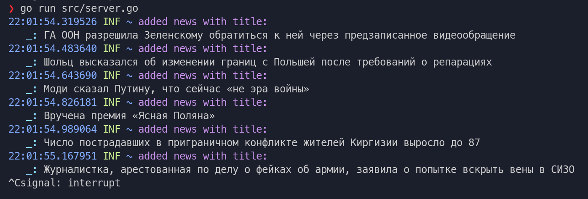
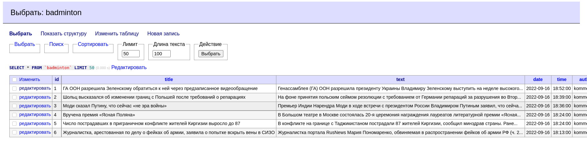

# Цели

Целью данной работы является разработка приложения выполняющего разбор RSS-
ленты новостей (по вариантам) и запись новостей в таблицу базы данных MySQL.

# Задачи

Для реализации приложения на языке GO выполняющего синтаксический разбор XML
файла формата RSS предлагается использовать любую из приведенных ниже библиотек,
либо предложить свою.

# Решение

## Исходный код

**`server.go`**

```go
package main

import (
	"database/sql"

	rss "github.com/SlyMarbo/rss"
	_ "github.com/go-sql-driver/mysql"
	log "github.com/mgutz/logxi/v1"
)

const url = "http://www.kommersant.ru/RSS/news.xml"

func main() {
	db, err := sql.Open("mysql", "iu9networkslabs:Je2dTYr6@tcp(students.yss.su)/iu9networkslabs")
	if err != nil {
		log.Error(err.Error())
		return
	}
	defer db.Close()

	feed, err := rss.Fetch(url)

	if err != nil {
		log.Error(err.Error())
	}

	for _, item := range feed.Items {
		var isPresent bool
		db.QueryRow("SELECT EXISTS (SELECT * FROM `badminton` WHERE `title` = ?)", item.Title).Scan(&isPresent)
		if isPresent {
			log.Info("post already in table")
			continue
		}
		_, err = db.Exec("INSERT INTO `badminton` (`title`, `text`, `date`, `time`, `author`) VALUES (?, ?, ?, ?, ?);", item.Title, item.Summary, item.Date.UTC(), item.Date.Local(), "kommersant")
		if err != nil {
			log.Error(err.Error())
		} else {
			log.Info("added news with title: ", item.Title)
		}
	}

}

```

## Пример работы





